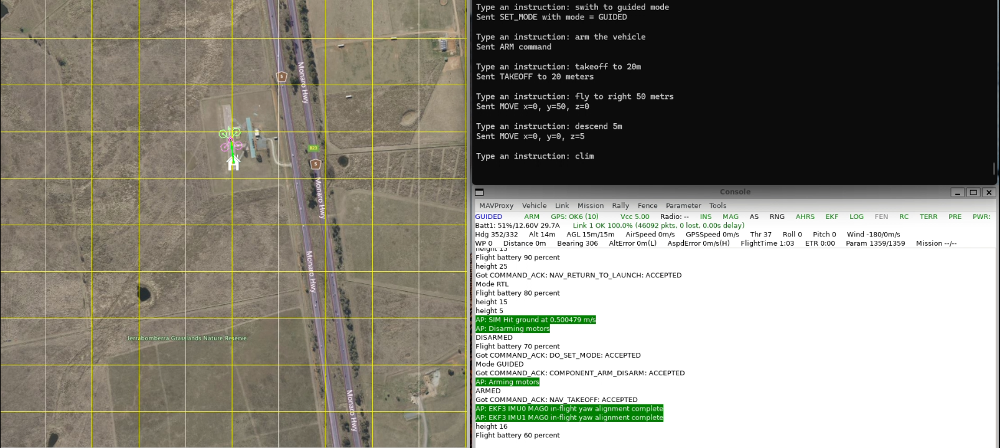

# <p align="center">TinyLink</p>

<p align="center">
  
</p>

TinyLink is a **lightweight fine-tuned LLM** that translates natural language instructions into commands for controlling drones and ground robots via MAVLink. Unlike cloud-based APIs, TinyLink runs **fully locally** on your laptop/desktop or embedded platforms (e.g., Jetson, Raspberry Pi) no high-end GPU or massive RAM required.




## Features 
- Translates plain text instructions into MAVLink commands.
- Runs entirely on-device for enhanced privacy. No internet, API keys, or cloud dependency.
- Runs on everyday hardware; no GPU or excessive RAM needed.
- Tested with ArduPilot SITL.
- Achieves **1.5–2.2s** inference times on CPU, depending on hardware.
- Supported Commands:
  1. Arm
  2. Disarm
  3. Takeoff
  4. Land
  5. Change mode (limited modes supported)
  6. Move in X, Y, Z (Copter and Rover)

## Performance & Tested Platforms  

| Platform                | RAM              | Inference Time (avg) | Status      |
|-------------------------|------------------|-----------------------|-------------|
| Win 11 (App) & WSL2 (SITL)         | 16 GB  | 1.7 - 4s (Avg 2.2s)          | ✅ Tested   |
| Raspberry Pi 5          | 4 GB   | 0.8 - 2s (Avg 1.5s)           | ✅ Tested |
| NVIDIA Jetson Nano      | -                | -                     | ❌ Not tested  |


**Notes**: 
- Performance may vary based on prompt length, hardware specs, and background processes.
- Running SITL/Gazebo on a separate machine can improve performance significantly.

## Installation

### 0. Pre-requisites
As of now, it has only been tested with ArduPilot SITL.
- **ArduPilot SITL**: Ensure ArduPilot SITL is installed and configured. Refer to the [ArduPilot documentation](https://ardupilot.org/dev/docs/sitl-simulator-software-in-the-loop.html) for setup instructions. As an alternative, you can use a docker container [ArduPilot SITL docker container](https://hub.docker.com/r/grep007/ardupilot-sitl-gui).

### 1. Clone this repository
Clone the TinyLink repository to your local machine:
```
git clone https://github.com/grep265/tinylink.git
```

### 2. Environment setup
Run the appropriate setup script for your OS. The setup script installs all necessary dependencies and configures the environment.
#### Linux/Mac
```
cd tinylink
bash setup.sh
```
#### Windows
```
cd tinylink
setup.bat
```

## Usage

### 1. Start ArduPilot SITL

In one terminal, launch the ArduPilot SITL environment for your desired vehicle (e.g., Copter). Replace `*IP*` and `*PORT*` with the appropriate values for your setup.

Example for Copter:
```
cd ardupilot
sim_vehicle.py -v ArduCopter --map --console -I0 --out=udp:*IP*:*PORT*
```

### 2. Run the App
Run TinyLink in another terminal.
#### Linux/Mac
```
cd tinylink
source tinylink-env/bin/activate
python main.py --connection udp:*IP*:*PORT*
```
#### Windows
```
cd tinylink
.\tinylink-env\Scripts\activate
python main.py --connection udp:*IP*:*PORT*
```
### 3. Type instructions

Examples of instructions:
```
- arm the system
- fly back to home
- takeoff to 20m
- move forward 80m
- switch to guided mode
- Climb 40m
```

### 4. Measure inference time (Optional)

For assessing the inference time taken by the LLM, you can add the following flag.

```
python main.py --connection udp:*IP*:*PORT* --time
```

## Contributing

Contributions are welcome! Suggest new MAVLink commands, test on hardware and share results, propose integrations with tools (e.g., GCS, ROS), etc.