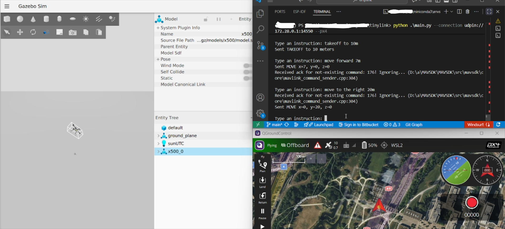
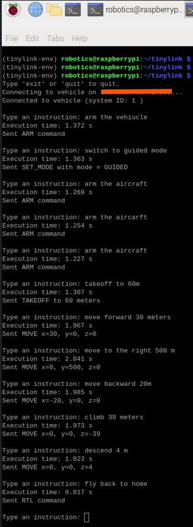

# <p align="center">TinyLink</p>

<p align="center">
  
</p>

TinyLink is a lightweight fine-tuned LLM that translates natural language instructions into commands for controlling drones and robots via MAVLink. Unlike cloud-based APIs, TinyLink runs **fully locally** on your laptop/desktop or embedded platforms (e.g., Jetson, Raspberry Pi), no high-end GPU or massive RAM required. With TinyLink, non-technical users and operators can give simple instructions in natural language to control the robots.

If you find TinyLink useful, please give it a ⭐ star.


## Features 
- Translates plain text instructions into MAVLink commands.
- Runs entirely on-device for enhanced privacy. No API keys or cloud dependency.
- Runs on everyday hardware; no GPU or excessive RAM needed.
- Tested with ArduPilot and PX4-Gazebo SITL.
- Achieves **0.9–2.2s** inference times on CPU, depending on hardware.
- Supported Commands:
  1. Arm
  2. Disarm
  3. Takeoff
  4. Land
  5. Change mode (limited modes supported)
  6. Move in X, Y, Z (Copter and Rover)

## Performance & Tested Platforms  

| Platform                | RAM              | Inference Time (avg) | Status      |
|-------------------------|------------------|-----------------------|-------------|
| Win 11 (TinyLink) & WSL2 (SITL)         | 16 GB  | 1.7 - 4s (Avg 2.2s)          | ✅ Tested   |
| Win 11 (TinyLink)         | 16 GB  | 0.5 - 1.2s (Avg 0.9s)          | ✅ Tested   |
| Raspberry Pi 5          | 4 GB   | 0.8 - 2s (Avg 1.5s)           | ✅ Tested |
| NVIDIA Jetson Nano      | -                | -                     | ❌ Not tested  |


**Notes**: 
- Performance may vary based on prompt length, hardware specs, and background processes.
- Running SITL/Gazebo on a separate machine can improve performance significantly.

## Installation

### 0. Pre-requisites
As of now, it has been tested with ArduPilot & PX4 SITL/Gazebo.

<details>
<summary>ArduPilot</summary>
  Ensure ArduPilot SITL is installed and configured. Refer to the <a href="https://ardupilot.org/dev/docs/sitl-simulator-software-in-the-loop.html">ArduPilot documentation</a> for setup instructions.
  As an alternative, you can use a docker container: <a href="https://hub.docker.com/r/grep007/ardupilot-sitl-gui">ArduPilot SITL docker container</a>.
</details>

<details>
<summary>PX4</summary>
  Ensure PX4-Gazebo SITL is installed and configured. Refer to the <a href="https://docs.px4.io/main/en/dev_setup/dev_env.html">PX4 documentation</a> for setup instructions.
  If you're using Windows & WSL2, follow these steps to connect QGroundControl (Windows side) to the simulation (WSL2): <a href="https://docs.px4.io/main/en/dev_setup/dev_env_windows_wsl.html#qgroundcontrol-on-windows">QGroundControl on Windows</a>.
</details>

### 1. Clone this repository
Clone the TinyLink repository to your local machine:
```
git clone https://github.com/grep265/tinylink.git
```

### 2. Environment setup
Run the appropriate setup script for your OS. The setup script installs all necessary dependencies and configures the environment.

<details>
<summary>Linux / Mac</summary>

  ```bash
  cd tinylink
  bash setup.sh
  ```
</details>

<details>
<summary>Windows</summary>

  ```bash
  cd tinylink
  setup.bat
  ```
</details>

## Usage

### 1. Launch SITL
<details>
<summary>ArduPilot</summary>

  ### ArduPilot SITL

  In one terminal, launch the ArduPilot SITL environment for your desired vehicle (e.g., Copter). Replace `*IP*` and `*PORT*` with the appropriate values for your setup.

  Example for Copter:
  ```bash
  cd ardupilot
  sim_vehicle.py -v ArduCopter --map --console -I0 --out=udp:*IP*:*PORT*
  ```
</details>


<details>
<summary>PX4</summary>

  ### PX4-Gazebo SITL

  In one terminal, launch the PX4-Gazebo SITL environment for your desired vehicle (e.g., Copter).

  Example for Copter:
  ```bash
  cd PX4-Autopilot
  make px4_sitl gz_x500
  ```
  Connect to QGroundControl, following the instructions from the pre-requisites step. Then, in your SITL terminal type the following command:
  ```bash
  mavlink start -u 14551 -r 4000000 -t 172.28.0.1
  ```
  
</details>

### 2. Run the App

  Run TinyLink in another terminal/PC.

#### 2.1 ArduPilot

<details>
<summary>Linux / Mac</summary>

  ```bash
  cd tinylink
  source tinylink-env/bin/activate
  python main.py --connection udp:*IP*:*PORT*
  ```
</details>

<details>
<summary>Windows</summary>

  ```bash
  cd tinylink
  .\tinylink-env\Scripts\activate
  python main.py --connection udp:*IP*:*PORT*
  ```
</details>

#### 2.2 PX4
<details>
<summary>Linux / Mac</summary>

  ```bash
  cd tinylink
  source tinylink-env/bin/activate
  python main.py --connection udpin://172.28.0.1:14550 --px4
  ```
</details>

<details>
<summary>Windows</summary>

  ```bash
  cd tinylink
  .\tinylink-env\Scripts\activate
  python main.py --connection udpin://172.28.0.1:14550 --px4
  ```
</details>

<details>
<summary>PX4 demo</summary>

  <p align="center">
    
  </p>
</details>

### 3. Type instructions

Examples of instructions:
```
- arm the system
- fly back to home
- takeoff to 20m
- move forward 80m
- switch to guided mode
- Climb 40m
- switch to offboard mode
```

### 4. Measure inference time (Optional)

For assessing the inference time taken by the LLM, you can add the following flag.

<details>
<summary>Ardupilot</summary>

  ```bash
  python main.py --connection udp:*IP*:*PORT* --time
  ```
</details>


<details>
<summary>PX4</summary>

  ```bash
  python main.py --time --connection udpin://172.28.0.1:14550 --px4
  ```
</details>

Results in a Raspberry Pi 5:
<details>
<summary>Raspberry Pi 5</summary>

  <p align="center">
    
  </p>
</details>

## Limitations

TinyLink uses a LLM, which means it can occasionally misinterpret or “hallucinate” commands.

## Contributing

Contributions are welcome! Suggest new MAVLink commands, test on hardware and share results, propose integrations with other software tools (e.g., GCS, ROS), etc. You can share your feedback, ideas, or demo images in the [GitHub Discussions](https://github.com/grep265/tinylink/discussions).
